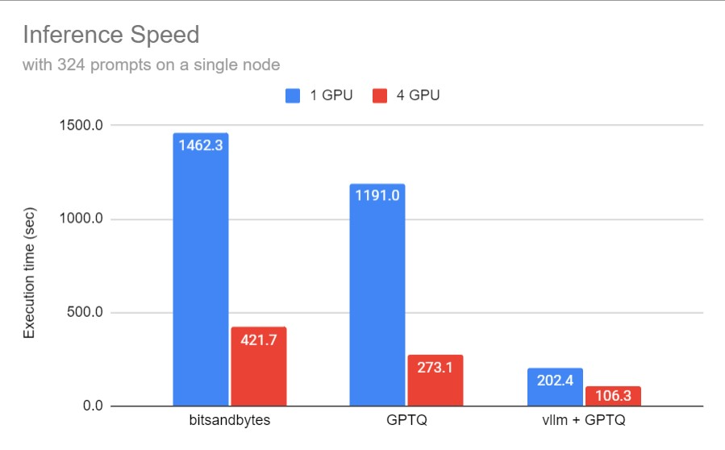
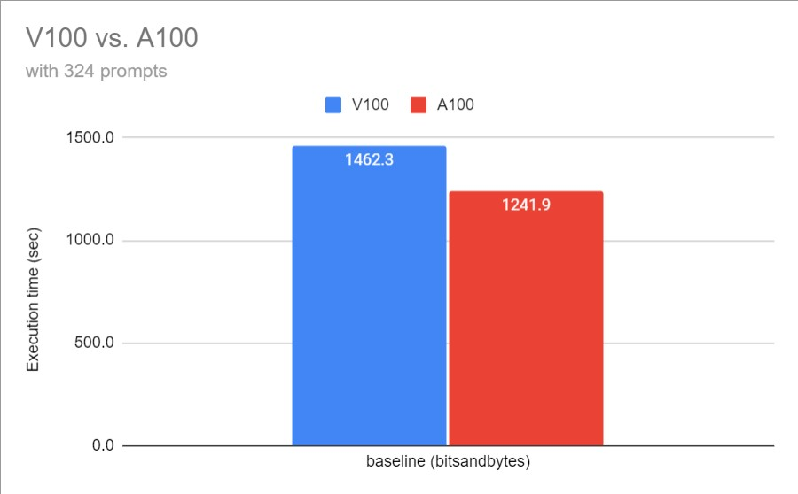
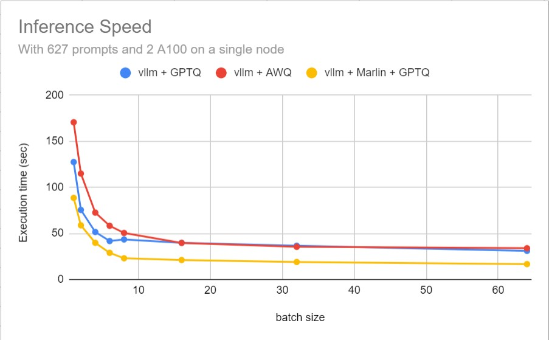
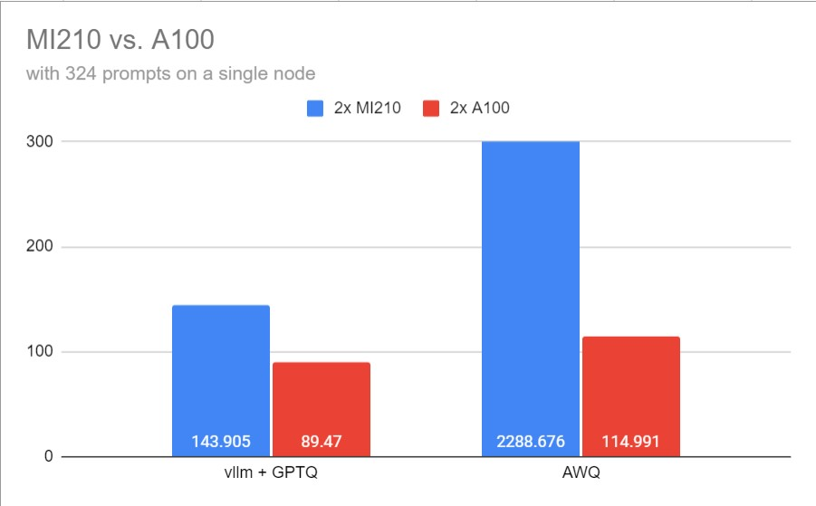

# ASC24-LLM inference optimization

The code and scripts used in ASC24 LLM inference optimization challenge for National Tsing Hua University Team. 

## Challenge description

This task focuses on the LLM inference optimization with AquilaChat2-34B model, which requires participating teams to build an inference engine with 4 bit or lower quantization to achieve high throughput while maintaining the quantization error within 1.5% on the MMLU dataset provided by the ASC24 Committees. 

## Quantization Scripts

In this task, we use *Marlin* + GPTQ with 4 bit quantization. To retrieve quantized AquilaChat2-34B with optimized GPTQ, use the modified GPTQ quantize script `./marlin/gptq/llama2.py`, which is a fork from the *Marlin* repo. Check out [Marlin](https://github.com/IST-DASLab/marlin) for more information.

## Run Scripts

The final task requirement given on site is to run inference with MMLU dataset by *lm-evaluation-harness* module. The `lm-eval` executable can be installed via pip or install from source. Check [lm-evaluation-harness](https://github.com/EleutherAI/lm-evaluation-harness) for more.

To run the required task, execute `run_case$(i).sh` directly, where `$(i)` indicated the case you want to run.

> **Note: remember to modify `model_path` and `hosts` in the run scripts to match your system. `baseline_modified.py` is inside `./LLM_inference/case3` folder.**

## Other files

there are some other files which are used during preparation and experiments.

### `./preparation-scripts`

The `preparation-scripts` folder stores the scripts and optimization attempts we used before contest. Since the final task and dataset is given on site, we use `ceval/ceval-exam` dataset for benchmarking and testing.

### `./prometheus`

This folder stores the scripts for monitoring the cluster status with `prometheus`. We use `ipmitool` to monitor CPU power usage and temperature. `nvidia-smi` and *DCGM-Exporter* is used for monitoring GPU power and temperature.

## Output submission 

The final submission for the contest on site is backed up in `./LLM_inference`.

## Results

On NVIDIA V100 platform, baseline Bitandbytes and GPTQ quantization are available. By using 4-bit quantization, we can see that the inference speed of GPTQ is better than  Bitsandbytes in the following chart. Furthermore, with the aid of *vllm*, the overall execution time can have dramatical reduction. Meanwhile, with 4 bits quantization, the memory usage of both GPTQ and Bitsandbytes is around 20 GB for AquilaChat2-34B model.

When moved to NVIDIA A100 platform, the available quantization tested here are Bitsandbytes, GPTQ, AWQ. While Bitsandbytes doesn't have official support in *vllm*, Only AWQ and GPTQ is selected as candidates to do more comparisons. By comparing the baseline Bitsandbytes output to V100, we can see that when batch size is set to 1, the difference between A100 and V100 is not that significant as expected. It shows strong memory bottleneck and low GPU utilization with standard huggingface `transformers`. When *vllm* is applied, the difference became significant. With 2 A100 and *vllm + GPTQ*, the overall inference time is better than 4 V100. GPTQ still performs the best when only execution time is considered. What's more, by using *Marlin* with *vllm* support, we can have about 1.5x to 2x of speed up, which is really amazing.

We also tested the performance between 2 A100 and 2 MI210 here. Since the bitsandbytes doesn't have official support for 4 bit quantization on AMD GPUs, Only GPTQ and AWQ is tested. Unfortunately, *vllm* doesn't have AWQ support on AMD GPUs. With the [AutoAWQ](https://github.com/casper-hansen/AutoAWQ) package used here, the inference performance is way worse than *vllm + GPTQ* since we have to turn off `fused_layers` when using AWQ with exllama kernels to prevent some internal errors, and the overall execution time is higher than A100 for about 60.7%.

